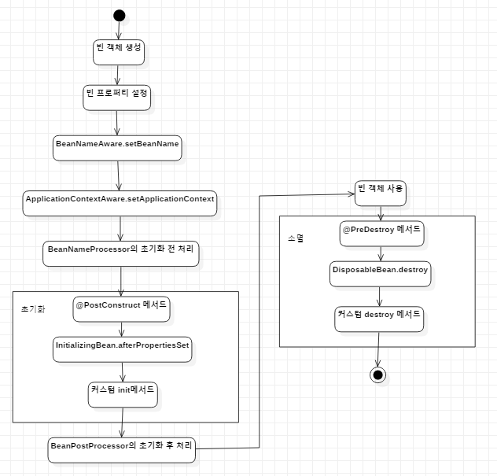

# 2스프링 핵심 기술 

## DI(Dependency Injection):의존 주입

- DI는 설계 패턴 중 하나
- 스프링은 기본적으로 DI를 기반으로 동작

### 의존 객체를 직접 생성하는 방식의 단점

의존 객체를 직접 생성해서 사용하는 방식의 단점은 이 의존 객체를 변경해야 하는 상황에서 개발자가 이 코드를 사용하고 있던 모든 코드들을 찾아 변경해야주어야 한다는 것이다.

```java
public class MyWallet{
    private Card card = new HyundaiCard();//의존 객체 직접 생성
    ...
} 
public class SamsungPay{
    private Card card = new HyundaiCard():
    ...
}
public class VisaCard{
    private Card card = new HyundaiCard();
}
```

현대 카드를 다른 카드로 바꾸기 위해서는 개발자가 직접 소스를 고쳐야한다. 지금은 두개의 클래스뿐이지만 이런 방식으로 의존하고 있는 클래스가 몇 십개~ 몇 백개가 된다면?


### 외부에서 객체를 받아오기

```java
public class MyWallet{
    
    private Card card;
    
    public MyWallet(Card card){
    	this.card = card;    
    }
}

public class SamsunPay{
    private Card card;
    
    public SamsungPay(Card card){
        this.card = card;
    }
}


```

객체를 외부에서 생성하여 전달받을 수 있도록 만든다.

```java
public class Assembler{
    private Card card;
    private MyWallet myWallet;
    private SamsungPay samsungPay;
    
    public Assembler(){
        card = new HyundaiCard();
        myWallet= new MyWallet(card);
        samsungPay = new SamsungPay(card);
    }
    
    public MyWallet getMyWallet(){
        return myWallet;
    }
    public SamsungPay getSamsungPay(){
        return samsungPay;
    }
}

Assembler assembler = new Assembler();
MyWallet wallet = assembler.getMyWallet();
...
SamsungPay samsungPay = assembler.getSamsungPay();
...
```

이렇게 구성이 되면 지금부터는 Assembler를 이용하여 필요한 클래스를 가져오기만 하면 된다. 만약 현대 카드에서 다른 카드로 바꾸고 싶다면 변경 범위가 사용하고 있는 모든 클래스가 아니라 Assembler코드로 좁혀지게 된다.

### 생성자 방식과 프로퍼티 방식

DI에서 의존 객체를 전달하는 방법은 크게 `생성자 방식`과 `프로퍼티 설정 방식`으로 구분한다.

<mark>생성자 방식</mark>

- 장점

  - 객체를 생성하는 시점에 의존하는 객체를 모두 받을 수 있다
  
- 객체 셍상하기 위해 파라미터를 전달받을 때 이 파라미터들을 체크하는 코드를 추가해 놓는다면, 객체 생성 이후에는는 이 객체가 사용 가능 상태임을 보장해줄 수 있다.
  
    ```java
      public class Car{
          public Car(Handle handle,Tire tire){
              if(handle==null || tire==null)
                  throw new IllegalArgumentException();
              this.handle = handle;
              this.tire = tire;
          }
      }
      
      ...
      Car car = new Car(handle,tire);
      car.run();
    ```
  
- 단점

  - Car객체를 생성할 시 파라미터를 전달하기 위해서는 파라미터의 순서를 알고 있어야 하고, 전달하는 파라미터의 이름만으로는 실제 타입을 알아내기 힘들수도 있다.

<mark>프로퍼티 방식</mark>

- 장점

  - 어떤 객체를 설정하는지 메서드 이름으로 알 수 있다.

    ```java
    Car car = new Car();
    car.setHandle(handle);
    car.setTire(tire);
    ```

- 단점

  - 객체가 생성한 뒤 의존 객체가 모두 설정되었다고 보장할 수 없다.

    ```java
    Car car = new Car();
    car.setHandle(handle);
    
    car.run(); //error
    ```


### 스프링은 객체를 생성하고 연결해주는 DI 컨테이너

스프링은 객체에 대한 정보(xml, annotation)을 읽어들여 각 객체를 생성하고 내부적으로 보관한다. 이를 `객체 컨테이너`라고도 부른다. 그리고 이 컨테이너 안에서 생성되어 있는 객체를 `스프링 빈`이라고 부른다. 컨테이너는 빈 객체를 <이름, 객체> 쌍으로 보관한다. (이름으로 각 객체를 구별한다.)


### BeanFactory 와 ApplicationContext

`BeanFactory`는 우리가 앞서 설명했던 <mark>객체를 생성하고 DI를 처리</mark>해주는 기능을 명시한 인터페이스다. 


그리고 `ApplicationContext`는 <mark>빈팩토리의 기능 외에 트랜잭션 처리, 자바 코드 기반 스프링 설정, 어노테이션을 이용한 빈 설정, 스프링을 이용한 웹 개발, 메시지 처리 등의 부가 기능등을</mark> 지니고 있다. 때문에 보통 BeanFactory보다는 ApplicationContext를 주로 사용한다. 


### 문법적인 부분은 넘기기..

### XML 설정 , 자바 설정

빈을 설정해놓을 때 `xml 설정` 방법과 `자바 코드 설정`이 있다. 

xml설정

- 설정 정보를 변경할 때에는 XML만 변경하면 된다.
- IDE 등의 코드 자동 완성 기능을 사용할 수 있으나, 만약 안된다면 일일히 작성해야한다.
- 코드를 실행해야 설정 정보 오류를 확인할 수 있다.

자바 코드 설정

- 컴파일러의 도움을 받기 때문에, 오타 등의 오류를 미리 알 수 있다.
- IDE가 제공하는 코드 자동 완성 기능의 도움을 받을 수 있다.

- 설정 정보를 변경하려면 자바 코드를 재컴파일해주어야 한다.


각각의 장점이 서로 다르기 때문에 이 둘을 적당히 혼합하여 사용해야한다.

### 스프링 컨테이너의 생성과 종료 

1. 컨테이너 생성
2. 빈 메타 정보(XML, 자바 코드)를 읽어 빈 객체 생성
3. 컨테이너 사용..
4. 컨테이너 종료(빈 객체 제거)

```java
GenericXmlApllicationContext ctx = new GenericXmlApplicationContext(); //컨테이너 생성

ctx.load("classpath:config.xml"); //빈 메타 정보 읽어오기

ctx.refresh();	//메타 정보를 이용하여 빈 객체 재생성

// 컨테이너 사용

ctx.close(); // 컨테이너 종료
```


### 스프링 컨테이너 계층 구조

스프링은 부모 - 자식 관계의 계층 구조를 가질 수 있다. 그렇게 되면 자식 컨테이너에서 부모 컨테이너에 생성된 빈을 참조할 수 있다. 하지만 반대로는 불가하다.


### 빈 라이프사이클과 빈 범위

스프링 컨테이너의 빈 관리

- 빈 객체 생성
- 프로퍼티 할당
- 초기화 수행
- 빈 소멸


빈 라이프 사이클




- 인터페이스.메서드의 경우 해당 빈 객체가 인터페이스를 구현했을 경우 메서드가 호출됨을 의미한다.
- 초기화와 소멸단계에서는 각 방식을 쌍을 이루어 함께 사용되곤 한다.
  - @PostConstruct메서드를 사용한다면 소멸때는 @PreDestroy메서드를 사용
  - 커스텀 init메서드를 사용한다면 커스텀 destroy메서드를 사용


| Scope       | Description                            |
| ----------- | -------------------------------------- |
| singleton   | 각 컨테이너에서 하나의 인스턴스만 생성 |
| prototype   | 요청시마다 인스턴스 생성               |
| request     | 범위를 HTTP 수명 주기로 조정           |
| session     | 범위를 Session 수명 주기로 조정        |
| application | 범위를 ServletContext 수명 주기로 조정 |
| websocket   | 범위를 WebSocket 수명 주기로 조정      |


## AOP(Aspect Oriented Programming)

- 어플리케이션은 특정 모듈에서만 필요로 하는 것이 아닌 전반에 걸쳐 사용할 기능이 있다.

  - 로깅, 트랜잭션, 보안 등등

- 이러한 공통 관심 사항들은 비즈니스 로직과 함께 섞여 있게 된다.

  - 공통 관심 사항들을 상속이나 위임 등을 사용하여 여러 모듈에 효과적으로 적용하는 데는 한계가 있으며, 중복된 코드를 양산한다.

- AOP를 이용하면 핵심 로직을 구현한 코드를 컴파일하거나, 컴파일 된 클래스를 로딩하거나, 또는 로딩한 클래스의 객체를 생성할 때 AOP가 적용되어 <mark>핵심 로직 구현 코드안에 공통 기능이 삽입</mark>된다.

- 핵심 로직에만 집중할 수 있다.

- 적용해야 할 공통 기능이 변경되더라도 핵심 로직 코드에 영향을 미치지 않는다.

- AOP 용어

  | 용어      | 의미                                                         |
  | --------- | ------------------------------------------------------------ |
  | Advice    | 언제 공통 관심 기능을 핵심 로직에 적용할 지를 정의. ex) 메소드 호출하기 전 |
  | Weaving   | Advice를 핵심 로직 코드에 적용하는 것. ex)컴파일,클래스 로딩,런타임 weaving |
  | Aspect    | 여러 객체에 공통으로 적용되는 기능. ex) 트랜잭션, 보안, 로깅 등... |
  | Joinpoint | Advice를 적용 가능한 지점. ex) 메서드 호출, 필드 값 변경 등  |
  | Pointcut  | Joinpoint의 부분 집합. 실제로 Advice가 적용되는 Joinpoint를 나타낸다. |

- Weaving

  - `컴파일 시 weaving` 은 AspectJ에서 사용하는 방식으로. <mark>컴파일 시에 AOP가 적용된 클래스 파일이 생성</mark>
  - `클래스 로딩 시 weaving`은 JVM이 클래스를 로딩할 때 클래스 정보를 변경하는 것. 원본 클래스 파일은 변경하지 않고 <mark>클래스를 로딩할 때에 JVM이 변경된 바이트 코드를 사용하도록 하는 것</mark>.
  - `런타임 시 weaving`은 소스 코드나 클래스 정보 자체를 변경하지 않고, <mark>프록시를 이용하여 AOP를 적용</mark>하는 것. 프록시는 메소드 기반으로 호출될 때에만 Advice가 적용가능하다.
  - <mark>스프링은 자체적으로 프록시 기반의 AOP를 지원(= 메서드 호출 Joinpoint만 지원)</mark>

- Advice

  - `Before Advice` : 대상 객체의 메서드 호출 전에 공통 기능 실행
    - Before Advice에서 익셉션을 발생시키면 대상 객체의 메서드가 호출되지 않는다.
    - 메서드 실행 전 접근 권한을 검사해서 없을 경우 익셉션을 발생시키는 기능을 구현하는 데 Before Advice가 적합.
  - `After Returning Advice` : 대상 객체의 메서드가 익셉션 없이 실행된 이후 실행
  - `After Throwing Advice` : 대상 객체의 메서드를 실행하는 도중 익셉션이 발생한 경우 실행
  - `After Advice` : 익셉션 여부에 상관없이 대상 객체 메서드 실행 후 공통 기능 실행
  - `Around Advice` : 대상 객체 메서드 실행 전, 후 또는 익셉션 발생 시점에 공통 기능 실행

### 프록시를 이용한 AOP

- 스프링은 Aspect의 <mark>적용 대상이 되는 객체 대한 프록시를 만들어 제공</mark>
- 대상 객체를 사용하는 코드는 결론적으로 프록시를 호출하게 된다
  
  - <mark>프록시는 공통 기능을 실행한 뒤 대상 객체의 실제 메서드를 호출</mark>한다
- 대상 객체가 인터페이스를 구현하고 있다면 자바에서는 리플렉션 API를 이용하여 대상 객체와 동일한 인터페이스를 구현한 프록시 객체가 생성된다.<mark>(JDK 동적 프록시)</mark>
  
  - 인터페이스를 기반으로 프록시 객체를 생성하기 때문에 그 외에 메서드에 대해서는 AOP가 적용이 안된다
  
    ```java
    public class MemberSerivceImpl implements MemberService {}
    
    ....
        
    MemberService memberService = ctx.getBean(MemberServiceImpl.class);
    
    System.out.println(memberService instanceof MemberService);//true
    System.out.println(memberService instanceof MemberServiceImpl);//false
    System.out.println(memberService.getClass().getName());//~$Proxy
    ```
  
- 대상 객체가 인터페이스를 구현하고 있지 않다면 스프링은 <mark>cglib</mark>를 이용하여 클래스에 대한 프록시를 생성
  
  - 클래스가 final인 경우 프록시를 생성할 수 없고, final 키워드가 붙은 메서드에 대해 AOP를 적용못한다.

> CGLIB :  코드 생성 라이브러리로, JAVA 클래스를 확장하고 런타임에 인터페이스를 구현하는 데 사용


### AOP 프록시 객체 생성 방식 설정

위에서 대상 객체가 인터페이스를 구현하고 있다면 해당 인터페이스를 구현한 새로운 프록시 객체를 만들게 된다고 하였다.

만약 인터페이스를 구현하고 있지만 인터페이스가 아닌 <mark>클래스를 기준으로 프록시를 생성</mark>하고 싶다면 아래와 같은 설정이 필요하다. 이렇게 되면  CGLIB를 이용하여 프록시를 생성하게 된다.

```java
@EnableAspectJAutoProxy(proxyTargetClass = true)
```

```xml
<aop:config proxy-target-class="true">
</aop:config>

or 

<aop:aspectj-autoproxy proxy-target-class="true"/>
```


### Advice 적용 순서

하나의 JoinPoint에 한 개 이상의 Advice가 적용될 경우 순서를 명시적으로 지정한다.

- @Order
- interface Ordered


## Environment

- 개발에는 로컬 개발 환경, 테스트 환경, 서비스 환경, 다국어 등에 따라 다른 값을 사용해야 할 수 있다. <mark>스프링은 Environment를 이용하여 환경에 따른 값을 설정할 수 있다</mark>.
- Environment는 두 가지 기능을 제공한다
  - PropertySource:<mark>프로퍼티 관리</mark>(시스템 환경 변수, JVM 시스템 프로퍼티, 프로퍼티 파일)
  - 특정 <mark>프로필 활성화</mark> 가능(개발 환경, 통합 테스트 환경, 실 서비스 환경)


### ConfigurableEnvironment

- ConfigurableApplicationContext를 통해 Environment의 하위 구조인 ConfigurableEnvironment를 가져올 수 있다. 

  ```java
  ConfigurableApplicationContext ctx = new GenericXmlApplicationContext();
  ConfigurableEnvironment env = ctx.getEnvironment();
  ```

- 프로필을 선택하는 기능과 PropertySource를 추가하는데 필요한 기능들이 있다.


### MutablePropertySources

- MutablePropertySources 에는 여러 개의 PropertySource가 등록될 수 있다. 이렇게 <mark>프로퍼티 설정이 여러 개일 경우 등록된 순서에 따라 차례대로 확인</mark>을 하게 된다.

-  [시스템 프로퍼티 - 환경 변수 - 자바 Properties] 순서로 프로퍼티를 등록하게 되면 Environment에 프로퍼티 값을 요청하게 되었을 때 이 순서 그대로 검색을 하게 된다.

- 스프링은 <mark>기본적으로 시스템 프로퍼티와 환경 변수</mark>를 사용하는 두 개의 PropertySource를 가진다.


### 프로퍼티 얻기

- ConfigurableEnvironment(시스템, 환경변수)
- MutablePropertySources에 사용자 PropertySource 추가해서 사용하기, @PropertySource,@PropertySources -> @Autowired로 Environment 객체 받아서 사용
- XML 설정( <context:property-placeholder>)
- PropertySourcesPlaceholderConfigurer 객체와 @Value 어노테이션 이용


### 프로필

- 데이터베이스 IP, 디렉토리 경로, 외부 서비스 URL 등 어떤 환경인지에 따라 달라진다.
- 프로터티 파일에서 값을 가져와 알맞게 변경해주면 되지만 <mark>환경이 바뀔 때마다 프로퍼티 파일을 수정하는 방법은 좋아보이지 않는다.</mark>
- 각 <mark>환경에 맞는 설정 정보를 따로 만들고, 환경에 따라 알맞은 설정 정보를 사용하는 것</mark>
- xml 에 profile 관련하여 설정을 하고,  Environment에서 profile active시키는 방법
- @Profile을 이용해서도 가능


### MessageSource

- 개발해야 할 어플리케이션이 <mark>다국어를 지원</mark>해야 할 경우


## 확장포인트

스프링의 기능을 확장하는 방법

- <mark>BeanFactoryPostProcessor</mark>를 이용한 빈 설정 정보 변경(빈 객체 생성 전 적용)
- <mark>BeanPostProcessor</mark>를 이용한 빈 객체 변경(빈 객체 생성 이후 적용)


### BeanFactoryPostProcessor

- 스프링은 빈 객체를 실제로 생성하기 전 설정 메타 정보를 변경하기 위한 용도로 이 인터페이스를 사용한다

- PropertySourcesPlaceholderConfigurer도 이 인터페이스를 구현함으로서 값으로 전달된 "${db.driver}"를 실제 값으로 변경해주는 기능을 제공한다.

  ```xml
  <bean id="connPool" class="com.spring.core.env.ConnectionPool">
  	<!-- PropertySourcesPlaceholderConfigurer가 프로퍼티를 실제 값으로 변경시킨다 -->
      <property name="driver" value="${db.driver}"/>
  </bean>
  ```

- BeanFactoryPostProcessor에는 정의된 postProcessBeanFactory메서드의 파라미터인 ConfigurableListableBeanFactory가 정의되어 있다..

- ConfigurableListableBeanFactory는 설정 정보를 구할 수 있는 두 개의 메서드를 제공한다

  - String[] getBeanDefinitionNames() : 모든 빈의 이름을 구한다.
  - BeanDefinition getBeanDefinition(String beanName) : 빈의 설정 정보를 구한다.
    - BeanDefinition 인터페이스는 빈 설정 정보를 구하거나 수정할 때 필요한 메서드를 정의

- @Configuration을 이용해서 생성하는 빈 객체는 빈 설정 정보를 만들지 못하기 때문에 ThresholdRequiredBeanFactoryPostProcessor를 만든다고 해도 설정 정보를 변경할 수 없다.


### BeanPostProcessor

- BeanPostProcessor는 생성된 빈 객체를 변경하는 방법을 사용한다.

- postProcessBeforeInitilization()메소드와 postProcessAfterInitialization()메소드가 정의되어 있다.

- 스프링은 빈 객체를 초기화하는 과정에서 두 메서드를 호출

  

- 두 개 이상의 BeanPostProcessor가 존재할 경우 Ordered 인터페이스를 이용해서 순서를 지정


### PropertyEditor

- 값을 설정할 때에는 항상 문자열형태로 입력을 하지만 스프링은 내부적으로 PropertyEditor를 이용해서 문자열을 알맞은 타입으로 변환한다.

- 스프링 3 이후에서는 ConversionService를 이용해서 타입 변환을 처리한다.

- 스프링이 제공하는 주요 PropertyEditor

  | PropertyEditor          | 설명                                                 | 기본 사용 |
  | ----------------------- | ---------------------------------------------------- | --------- |
  | ByteArrayPropertyEditor | String.getByte()를 이용해서 문자열을 byte배열로 변환 | 기본      |
  | CharArrayPropertyEditor | String.toCharArray()                                 |           |
  | CharsetEditor           | 문자열을 Charset 으로 변환                           | 기본      |
  | ClassEditor             | 문자열을 Class 타입으로 변환                         | 기본      |
  | CurrencyEditor          | 문자열을 Currency 타입으로 변환                      |           |
  | CustomBooleanEditor     | 문자열을 Boolean 타입으로 변환                       | 기본      |
  | CustomDateEditor        | DateFormat을 이용해서 Date로 변환                    |           |
  | CustomNumberEditor      | Long,Double,BigDecimal 등 숫자 타입                  | 기본      |
  | FileEditor              | File로 변환                                          | 기본      |
  | LocaleEditor            | Locale로 변환                                        | 기본      |
  | PatternEditor           | 정규 표현식 문자열을 Pattern으로 변환                | 기본      |
  | PropertiesEditor        | Properties로 변환                                    | 기본      |
  | URLEditor               | URL로 변환                                           | 기본      |

- 기본으로 설정되어 있지 않은 Editor는 PropertyEditor를 추가로 등록해주어야 한다.

- 커스텀 PropertyEditor
  - PropertyEditorSuppot 상속받아 클래스 생성. 변환 대상 타입과 동일한 패키지에 '타입Editor' 이름으로 놓는다. 
  - 패키지가 다르거나 , 이름이 '타입Editor'를 따르고 있지 않다면 CustomEditorConfigurer를 이용해서 설정한다.
  - Editor에 매개 변수를 지정하고 싶을 때는 PropertyEditrRegistrar를 이용


### ConversionService

- 스프링3에서부터 지원

- PropertyEditor는 문자열과 타입 간의 변환을 처리해주는 방식

- ConversionService는 타입과 타입 간의 변환을 처리한다(더 범용적이다)

- ConversionService를 등록하게 되면 스프링은 이를 PropertyEditor대신 사용하게 된다.

  

  

#### ConversionServiceFactoryBean을 이용하여 ConversionService등록

  - DefaultConversionService는 스프링이 제공하는 ConversionService의 구현이며, 이를 사용하기 위해서는 ConversionServiceFactoryBean을 등록하는 것이다.
  - 등록을 할 때 id를 'conversionService'로 등록하여야 한다.
  - DefaultConversionService
      - 직접 타입 변환을 하지 않고 등록된 GenericConverter에 위임
          - 소스 객체의 타입을 대상 타입으로 변환해주는 Generic Converter를 찾는다.
          - 존재할 경우 Generic Converter를 이용하여 변환
          - 존재하지 않을 경우 Exception 발생


#### GenericConverter를 이용한 커스텀 변환 

- GenericConveter 인터페이스를 구현한 Converter를 생성
- ConversionServiceFactoryBean의 converters 프로퍼티에 추가


#### Converter를 이용한 구현

- 다양한 타입들이 존재하고 이것들을 모두 GenericConverter를 이용해서 구현하는 것은 코드가 많아지고 복잡해지게 만든다.
- 타입 변환이 단순한 경우에는 Converter 인터페이스를 사용하여 쉽게 구현가능하다.


#### FormattingConversionServiceFactoryBean

- DefaultGenericConverter이 Formatter를 이용해서 타입 변환을 수행하는 구현체
- Converter/GenericConverter 외에 날짜/시간 변환을 위한 Formatter와 Converter를 추가로 등록

