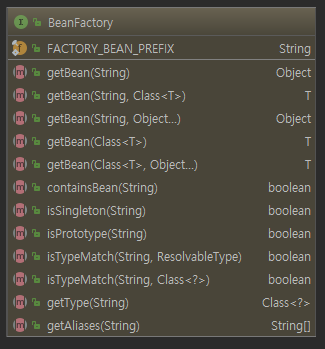

# 스프링 핵심 기술 

## DI(Dependency Injection):의존 주입

- DI는 설계 패턴 중 하나
- 스프링은 기본적으로 DI를 기반으로 동작

### 의존 객체를 직접 생성하는 방식의 단점

의존 객체를 직접 생성해서 사용하는 방식의 단점은 이 의존 객체를 변경해야 하는 상황에서 개발자가 이 코드를 사용하고 있던 모든 코드들을 찾아 변경해야주어야 한다는 것이다.

```java
public class MyWallet{
    private Card card = new HyundaiCard();//의존 객체 직접 생성
    ...
} 
public class SamsungPay{
    private Card card = new HyundaiCard():
    ...
}
public class VisaCard{
    private Card card = new HyundaiCard();
}
```

현대 카드를 다른 카드로 바꾸기 위해서는 개발자가 직접 소스를 고쳐야한다. 지금은 두개의 클래스뿐이지만 이런 방식으로 의존하고 있는 클래스가 몇 십개~ 몇 백개가 된다면?


### 외부에서 객체를 받아오기

```java
public class MyWallet{
    
    private Card card;
    
    public MyWallet(Card card){
    	this.card = card;    
    }
}

public class SamsunPay{
    private Card card;
    
    public SamsungPay(Card card){
        this.card = card;
    }
}


```

객체를 외부에서 생성하여 전달받을 수 있도록 만든다.

```java
public class Assembler{
    private Card card;
    private MyWallet myWallet;
    private SamsungPay samsungPay;
    
    public Assembler(){
        card = new HyundaiCard();
        myWallet= new MyWallet(card);
        samsungPay = new SamsungPay(card);
    }
    
    public MyWallet getMyWallet(){
        return myWallet;
    }
    public SamsungPay getSamsungPay(){
        return samsungPay;
    }
}

Assembler assembler = new Assembler();
MyWallet wallet = assembler.getMyWallet();
...
SamsungPay samsungPay = assembler.getSamsungPay();
...
```

이렇게 구성이 되면 지금부터는 Assembler를 이용하여 필요한 클래스를 가져오기만 하면 된다. 만약 현대 카드에서 다른 카드로 바꾸고 싶다면 변경 범위가 사용하고 있는 모든 클래스가 아니라 Assembler코드로 좁혀지게 된다.

### 생성자 방식과 프로퍼티 방식

DI에서 의존 객체를 전달하는 방법은 크게 `생성자 방식`과 `프로퍼티 설정 방식`으로 구분한다.

<mark>생성자 방식</mark>

- 장점

  - 객체를 생성하는 시점에 의존하는 객체를 모두 받을 수 있다
  
- 객체 셍상하기 위해 파라미터를 전달받을 때 이 파라미터들을 체크하는 코드를 추가해 놓는다면, 객체 생성 이후에는는 이 객체가 사용 가능 상태임을 보장해줄 수 있다.
  
    ```java
      public class Car{
          public Car(Handle handle,Tire tire){
              if(handle==null || tire==null)
                  throw new IllegalArgumentException();
              this.handle = handle;
              this.tire = tire;
          }
      }
      
      ...
      Car car = new Car(handle,tire);
      car.run();
    ```
  
- 단점

  - Car객체를 생성할 시 파라미터를 전달하기 위해서는 파라미터의 순서를 알고 있어야 하고, 전달하는 파라미터의 이름만으로는 실제 타입을 알아내기 힘들수도 있다.

<mark>프로퍼티 방식</mark>

- 장점

  - 어떤 객체를 설정하는지 메서드 이름으로 알 수 있다.

    ```java
    Car car = new Car();
    car.setHandle(handle);
    car.setTire(tire);
    ```

- 단점

  - 객체가 생성한 뒤 의존 객체가 모두 설정되었다고 보장할 수 없다.

    ```java
    Car car = new Car();
    car.setHandle(handle);
    
    car.run(); //error
    ```


### 스프링은 객체를 생성하고 연결해주는 DI 컨테이너

스프링은 객체에 대한 정보(xml, annotation)을 읽어들여 각 객체를 생성하고 내부적으로 보관한다. 이를 `객체 컨테이너`라고도 부른다. 그리고 이 컨테이너 안에서 생성되어 있는 객체를 `스프링 빈`이라고 부른다. 컨테이너는 빈 객체를 <이름, 객체> 쌍으로 보관한다. (이름으로 각 객체를 구별한다.)


### BeanFactory 와 ApplicationContext

`BeanFactory`는 우리가 앞서 설명했던 <mark>객체를 생성하고 DI를 처리</mark>해주는 기능을 명시한 인터페이스다. 



그리고 `ApplicationContext`는 <mark>빈팩토리의 기능 외에 트랜잭션 처리, 자바 코드 기반 스프링 설정, 어노테이션을 이용한 빈 설정, 스프링을 이용한 웹 개발, 메시지 처리 등의 부가 기능등을</mark> 지니고 있다. 때문에 보통 BeanFactory보다는 ApplicationContext를 주로 사용한다. 


### 문법적인 부분은 넘기기

### XML 설정 , 자바 설정

빈을 설정해놓을 때 `xml 설정` 방법과 `자바 코드 설정`이 있다. 

xml설정

- 설정 정보를 변경할 때에는 XML만 변경하면 된다.
- IDE 등의 코드 자동 완성 기능을 사용할 수 있으나, 만약 안된다면 일일히 작성해야한다.
- 코드를 실행해야 설정 정보 오류를 확인할 수 있다.

자바 코드 설정

- 컴파일러의 도움을 받기 때문에, 오타 등의 오류를 미리 알 수 있다.
- IDE가 제공하는 코드 자동 완성 기능의 도움을 받을 수 있다.

- 설정 정보를 변경하려면 자바 코드를 재컴파일해주어야 한다.